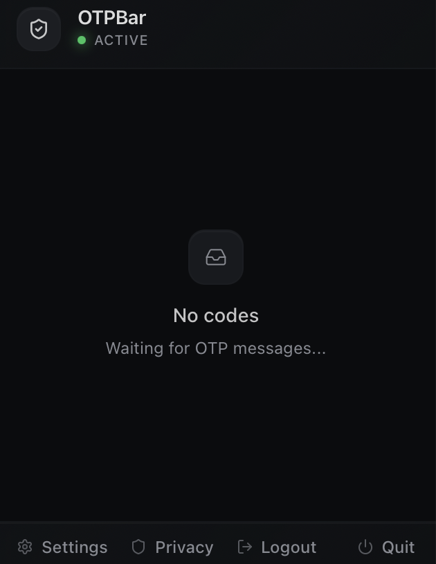

<div align="center">

# OTPBar

**A privacy-first macOS menu bar app that finds one-time passcodes in Gmail and puts them one click away.**

[](https://github.com/tanRdev/otpbar/actions/workflows/build.yml)

[](LICENSE)



</div>

OTPBar watches unread Gmail messages, normalizes MIME safely, classifies likely 4–8 digit OTPs, and surfaces recent codes from the menu bar. Gmail access is read-only, processing stays on-device, automatic copying requires consent, and credentials live in macOS Keychain.

> [!IMPORTANT]
> OTPBar v2 is under active development on `main`; no v2 binary has been released. Monitoring remains fail-closed until the encrypted-store migration bootstrap is connected to the scheduler. Build from source for development and review, not daily use.

## Highlights

- **Fast menu bar workflow** — Recent codes are available without opening Gmail.
- **Conservative detection** — Bounded MIME parsing and contextual ranking reject dates, phone numbers, prices, order IDs, tracking numbers, attachments, and quoted replies.
- **Native OAuth security** — PKCE, a fresh loopback port per attempt, constant-time state validation, bounded callbacks, and no client secret.
- **Privacy by construction** — Encrypted atomic local snapshots, keyed message identities, redacted diagnostics, payload-free effect metadata, and no OTP replay after restart.
- **Safe clipboard ownership** — Every manual or automatic copy uses one replaceable lease. If the platform cannot prove ownership atomically, expiry fails closed instead of clearing unrelated clipboard content.
- **Least-privilege desktop shell** — A restrictive CSP and command-by-command Tauri capabilities keep direct clipboard and unrelated plugin authority out of the webview.

## Architecture

```text
Gmail (read-only)
    │
    ▼
bounded transport → MIME normalization → OTP classification
                                           │
                                           ▼
                          atomic Seen / History / effect metadata
                                           │
                         ┌─────────────────┴─────────────────┐
                         ▼                                   ▼
                  Recent Codes                         best-effort effects
                                                     (clipboard / notice)
```

The Rust core separates transport, interpretation, persistence, scheduling, authorization, and desktop effects behind typed ports. Crash-sensitive state changes cross an authenticated atomic-store durability barrier before publication or external effects.

For the detailed engineering rationale, see [the modernization specification](docs/modernization-spec.md), [implementation plan](docs/implementation-plan.md), and [architecture decisions](docs/adr/).

## Build from source

### Requirements

- macOS 10.13+
- Xcode Command Line Tools
- Node.js 24.18.0 and npm 11.16.0
- Rust 1.94.0
- Go 1.26.5 for workflow validation
- A Google OAuth **Desktop app** client ID with the Gmail API enabled

```bash
git clone https://github.com/tanRdev/otpbar.git
cd otpbar
npm ci
cp .env.example .env
```

Set the public Desktop client ID in `.env`:

```dotenv
GOOGLE_CLIENT_ID=your-client-id.apps.googleusercontent.com
```

Then run:

```bash
npm run tauri dev
```

No Google client secret is used or expected.

## Quality gates

```bash
npm run verify:code
CI=true npm run tauri build -- --bundles app
```

The blocking gate covers formatting, linting, TypeScript, frontend tests, Rust tests, strict Clippy, builds, dependency audits, and GitHub Actions validation.

## Security and privacy

- OAuth tokens are stored as one versioned bundle in macOS Keychain.
- The app requests only `gmail.readonly`.
- Local history uses authenticated encryption and crash-safe replacement.
- Raw Gmail message IDs and OTPs are excluded from durable effect metadata and diagnostic output.
- History retention is independent from the Seen Message ledger used for idempotency.
- Clipboard expiry never uses a read-then-clear race.

Security-sensitive design details and limitations—including APFS/SSD deletion semantics and fail-closed clipboard expiry—are documented in [the specification](docs/modernization-spec.md).

The release workflow requires Developer ID signing, notarization, stapling, Gatekeeper verification, and SHA-256 checksums before publication. OTPBar currently uses manual updates; see [the release runbook](docs/releasing.md).

## Contributing

See [CONTRIBUTING.md](CONTRIBUTING.md). Please run `npm run verify:code` before submitting changes.

## License

[MIT](LICENSE)

_Last reviewed: July 2026._
