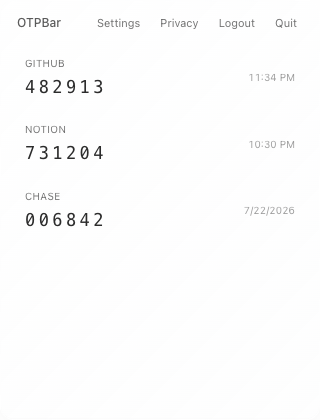
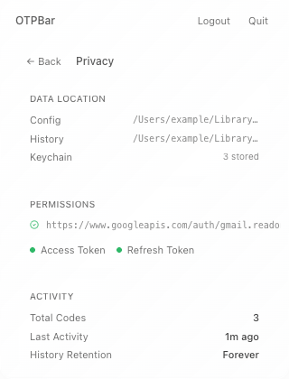
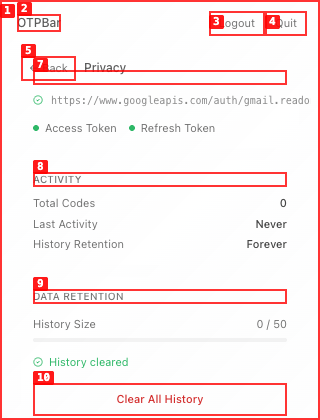
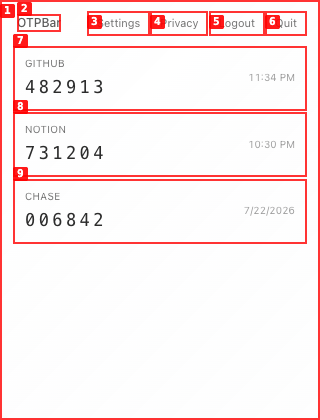
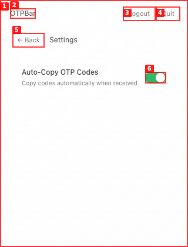
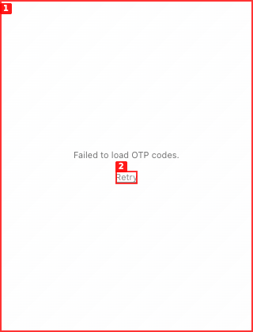
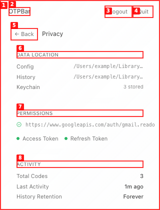

# OTPBar product dogfood report

| Field | Value |
|---|---|
| Date | 2026-07-23 |
| App URL | `http://localhost:1420/audit/dogfood/harness.html` |
| Session | `otpbar-video2` |
| Scope | Signed-out, populated, empty, settings, privacy, error, and destructive-action states |

## Test boundary

The production React and CSS were exercised unchanged at the configured
320 × 420 window size. The real Tauri development process built and launched,
but its accessory window was not exposed to macOS accessibility automation.
An audit-only harness therefore supplied deterministic command responses.
This report uses that harness only for frontend rendering and state
reconciliation. Backend findings belong in the repository audit, not here.

## Summary

| Severity | Count |
|---|---:|
| Critical | 1 |
| High | 2 |
| Medium | 2 |
| Low | 1 |
| **Total** | **6** |

## Issues

### ISSUE-001: Clearing history leaves the main list stale

| Field | Value |
|---|---|
| Severity | high |
| Category | functional |
| URL | Privacy → Data retention |
| Repro video | [issue-001-clear-history-repro-final.webm](videos/issue-001-clear-history-repro-final.webm) |

**Description**

After clearing history, the privacy projection correctly reports zero codes,
but returning to the main view still shows the deleted entries. The user cannot
trust whether the destructive action succeeded. The frontend holds its own code
list and the clear-history command does not publish or consume an updated list.

**Repro steps**

1. Start with three recent codes.
   
2. Open Privacy.
   
3. Activate **Clear All History**.
   
4. Observe that Privacy reports `0 / 50` and “History cleared.”
   
5. Return to the main view and observe that all three deleted codes remain.
   

---

### ISSUE-002: The settings switch has no accessible name

| Field | Value |
|---|---|
| Severity | critical |
| Category | accessibility |
| URL | Settings |
| Repro video | N/A |

**Description**

The auto-copy switch is an unlabeled `button`. Axe reports a WCAG 4.1.2
`button-name` violation with critical impact. A screen-reader user encounters
an unnamed control and cannot determine what setting it changes or whether it
is on.

---

### ISSUE-003: Primary controls are materially undersized

| Field | Value |
|---|---|
| Severity | medium |
| Category | accessibility / UX |
| URL | All views |
| Repro video | N/A |

**Description**

At the production window size, measured button heights are 24.5 px for header
and back controls and 20 px for the settings switch. Body labels are commonly
10–12 px. The interface is visually delicate but difficult to acquire with a
pointer, especially for users with motor or low-vision impairments.

---

### ISSUE-004: The empty state does not communicate system status

| Field | Value |
|---|---|
| Severity | medium |
| Category | UX |
| URL | Main view with no recent codes |
| Repro video | N/A |

**Description**

“Waiting for OTP messages…” does not say which account is connected, whether
monitoring is healthy, when Gmail was last checked, whether auto-copy is
enabled, or what the user should do if a code does not appear. The most common
steady state is therefore indistinguishable from a stalled poller.

---

### ISSUE-005: A secondary startup failure replaces the entire app shell

| Field | Value |
|---|---|
| Severity | high |
| Category | functional / UX |
| URL | Startup |
| Repro video | N/A |

**Description**

If loading recent codes fails, the whole app becomes a generic error and Retry
button. The user loses Quit, sign-in/sign-out, Settings, Privacy, and any
diagnostic context even when authentication status loaded successfully. Partial
startup failures should degrade the affected module rather than block the
entire menubar app.

---

### ISSUE-006: Privacy details are truncated without a recovery path

| Field | Value |
|---|---|
| Severity | low |
| Category | content / UX |
| URL | Privacy |
| Repro video | N/A |

**Description**

Configuration and history paths are truncated to 140 px, and the Gmail scope
clips in the 320 px window. There is no tooltip, selection, copy action, or
“Reveal in Finder” action, so the dashboard advertises transparency while
hiding the exact values a user would need.

